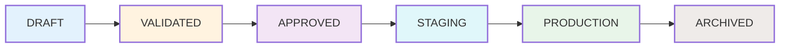
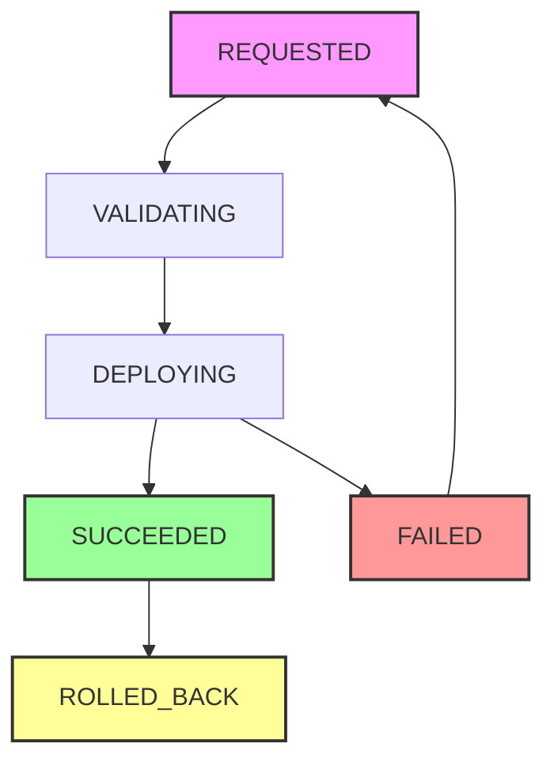

## Model Registry Workflow



## Deployment Workflow



## Model and Deployment Workflow
```mermaid
graph LR
    subgraph Model_Registry["Model Registry"]
        MR_Model[Model] --> MR_Version[Version] --> MR_Approval[Approval]
    end
    
    subgraph Deployment_Management["Deployment Management"]
        DM_Requested[Requested] --> DM_Validating[Validating]
        DM_Validating --> DM_Deploying[Deploying]
        DM_Deploying --> DM_Success[Succeeded]
        DM_Deploying --> DM_Fail[Failed]
        DM_Fail -->|Retry| DM_Requested
        DM_Success --> DM_Rollback[Rolled Back]
    end
    
    MR_Approval -->|Approved Version| DM_Requested
    
    style Model_Registry fill:#e3f2fd,stroke:#1565c0,stroke-width:2px
    style Deployment_Management fill:#f3e5f5,stroke:#7b1fa2,stroke-width:2px
    
    style MR_Model fill:#bbdefb
    style MR_Version fill:#bbdefb
    style MR_Approval fill:#bbdefb
    
    style DM_Requested fill:#fff3e0
    style DM_Validating fill:#fff3e0
    style DM_Deploying fill:#fff3e0
    style DM_Success fill:#c8e6c9
    style DM_Fail fill:#ffcdd2
    style DM_Rollback fill:#fff9c4
 ```   